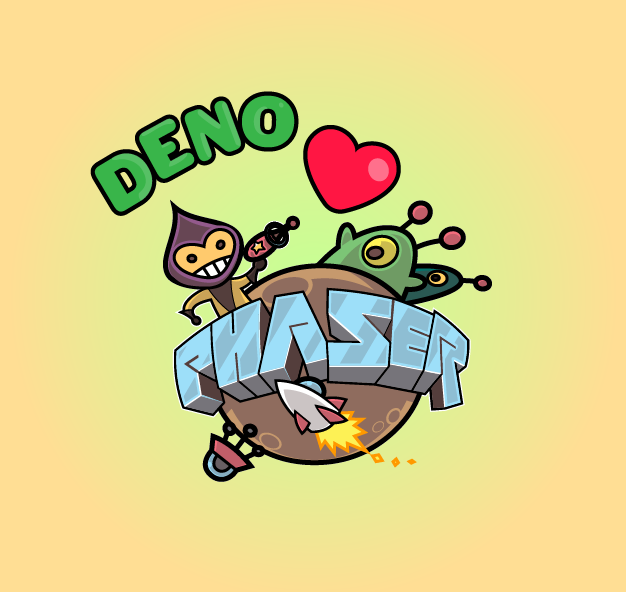

# A Phaser TypeScript Template for Deno and Fresh

This is a Phaser 3 project template that leverages Deno, Fresh, and esbuild for an efficient development experience. It integrates esbuild for fast bundling, utilizes Fresh for Deno-based modern web development, and supports TypeScript out of the box. The template also features hot-reloading for streamlined development cycles and includes scripts to generate optimized, production-ready builds. TypeScript is supported out-of-the box without any additional configuration.

### Versions

This template has been created for:

- [Phaser 3.70.0](https://github.com/phaserjs/phaser)
- [Deno 1.40.3](https://github.com/denoland/deno)
- [Fresh 0.1.0](https://github.com/denoland/fresh)
- [esbuild 0.20.0](https://github.com/esbuild/deno-esbuild)
- [TypeScript 5.3.3](https://github.com/microsoft/TypeScript)



## Requirements

[Deno](https://deno.com) is required to run this template. Please see the [Deno installation guide](https://deno.com/manual/getting_started/installation) for more information.

## Available Commands

| Command | Description |
|---------|-------------|
| `deno task check` | Lints and type checks all files |
| `deno task start` | Run the build processes and start the development server |
| `deno task dev` | Launch the development server and watch for file changes. This will also build the Phaser code within the /game directory upon each save |
| `deno task build` | Run the entire build process for the Deno project |
| `deno task build-fresh` | Run the build process for Fresh |
| `deno task build-phaser` | Run the build process for Phaser |
| `deno task preview` | Preview the web server |
| `deno task update` | Update the Deno Fresh project |


## Writing Code

Clone the repo and run `deno task start` to start the development server. No installation of any other packages is required.

The local development server runs on `http://localhost:8000` by default. Please see the [Fresh](https://fresh.deno.dev/docs/getting-started/running-locally) documentation on how to change this.

Once the server is running you can edit any of the files in the `game` folder. Deno will automatically recompile and execute the build steps for your project.

## Phaser references in Deno
In Deno you will need to reference the Phaser TypeScript declaration file in each file that uses Phaser. You will also need to import the Phaser ESM module. This is done by adding the following to the top of your file:
```ts
/// <reference lib="./phaser.d.ts" />
import { Phaser } from "phaser";
// Other imports..

// The rest of your code..
```

## Template Project Structure

We have provided a default project structure to get you started. This is as follows:

- `.github/workflows` - Contains the GitHub Action for deploying the project.
- `.vscode` - Contains the Visual Studio Code settings for a Deno-based project.
- `build.ts` - Contains the build script for the `/game` directory.
- `components` - Contains the Fresh components.
- `game` - Contains the game source code.
- `game/main.ts` - The main entry point. This contains the game configuration and starts the game.
- `game/scenes/` - The Phaser Scenes are in this folder.
- `game/phaser.d.ts` - Phaser TypeScript declarations imported from jsdelivr.
- `game/config` - Contains Phaser specific configuration files for centralized use.
- `game/utils` - Contains utility functions to encourage clean code within game scene files.
- `node_modules` - Contains specific dependencies for the Fresh server.
- `routes` - Contains the Fresh server routes.
- `routes/index.tsx` - A basic TSX file that references the phaser bundle.
- `routes/api` - Contains the API routes for any custom server-side logic.
- `static` - Contains the static assets used by the game and web server.
- `static/styles.css` - Some simple CSS rules to help with page layout.
- `static/assets` - Contains the static assets used by the game.

## Handling Assets

esbuild supports loading assets via JavaScript module `import` statements (not recommended). This is because assets imported via the `import` statement are included in the bundle, which can significantly increase the bundle size.

```ts
// Importing the asset directly (not recommended)
import myAsset from './myAsset.png'

//..
preload ()
{
    // Load the imported asset
    this.load.image('myAsset', myAsset);
}
```

It is better to load the assets via the Phaser Loader, as this will load the assets at runtime and not include them in the bundle. To load static files such as audio files, videos, etc place them into the `static/assets` folder. Then you can use this path in the Loader calls within Phaser.

*Note that the `static/` folder is treated as the root directory by Phaser, so all paths should be relative to this folder.*


```ts
//..
preload ()
{
    // Load the asset from the static folder
    this.load.image('myAsset', 'assets/myAsset.png');
}
```

## Deploying the Project

Run the GitHub Action to deploy the project directly to Deno Deploy, a serverless platform for running JavaScript, TypeScript, and WebAssembly at the edge, powered by Deno.

Alternatively, you can run the `deno task build` command to generate a production build to deploy to your own specific platform, and deploy the `_fresh` folder. `_fresh/main.js` is the entrypoint for the Fresh server.

## Customizing the Template

### deno.json

If you want to add more tasks, modify existing one, or add third-party libraries, you can modify the `deno.json` file. This file is used by the Fresh server to define the tasks and dependencies for the project.

### esbuild

If you want to customize your build, such as adding plugin (i.e. for loading CSS or fonts), you can modify the `build.ts` file for cross-project changes, or you can modify and/or create new configuration files and target them in specific deno tasks inside of `deno.json`. Please see the [esbuild documentation](https://esbuild.github.io/api/) for more information.

## Credit
The following template [ESbuild ESM Template](https://github.com/phaserjs/template-esbuild-ts) was used as inspiration for this template. Additional assets were created by me (Shon Thomas), and are free to use.

All Phaser logos and character trademarks are &copy; 2011-2024 Phaser Studio Inc. All rights reserved.
All Deno logos and character trademarks are &copy; 2018-2024 Deno Land Inc. All rights reserved.
